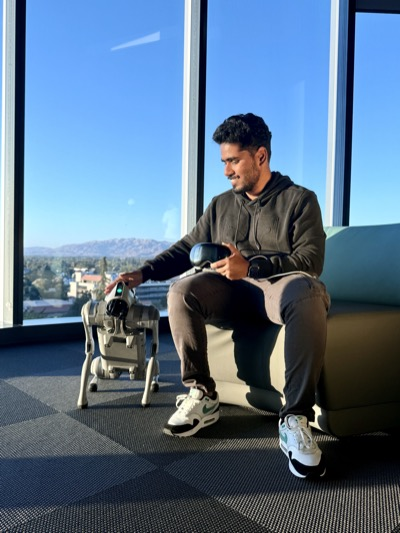

  
  

    

      Hey! I'm Ranga Reddy Nukala. I'm in the <a href="https://www.sjsu.edu/applied-data-science/msadi/index.php" target="_blank">Applied Data Intelligence MS</a> program at <a href="https://www.sjsu.edu/applied-data-science/index.php" target="_blank">SJSU</a>, focused on LLMs, physical AI, and robotics. Before grad school, I was a Senior Software Engineer building iOS apps with Swift and SwiftUI - two-time <a href="https://developer.apple.com/swift-student-challenge/" target="_blank">Apple Swift Student Challenge</a> winner (WWDC'20 & '21).
    

    

      This blog is where I write up experiments, reading notes, and things I built. Topics are mostly ML/AI with occasional Swift posts.
    

  

