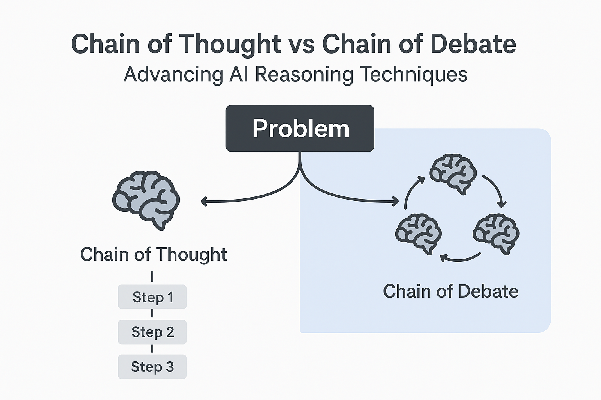
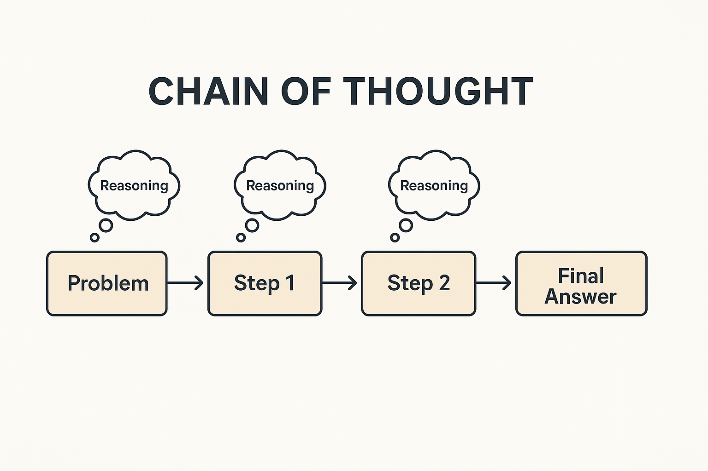
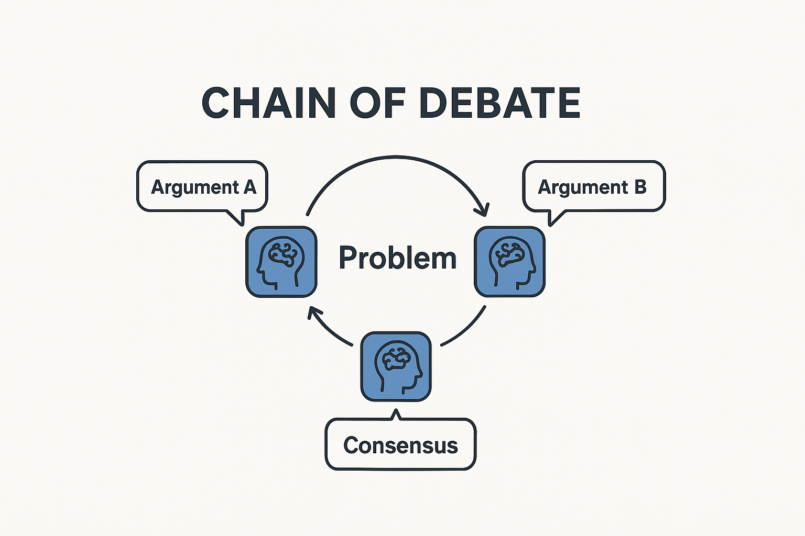
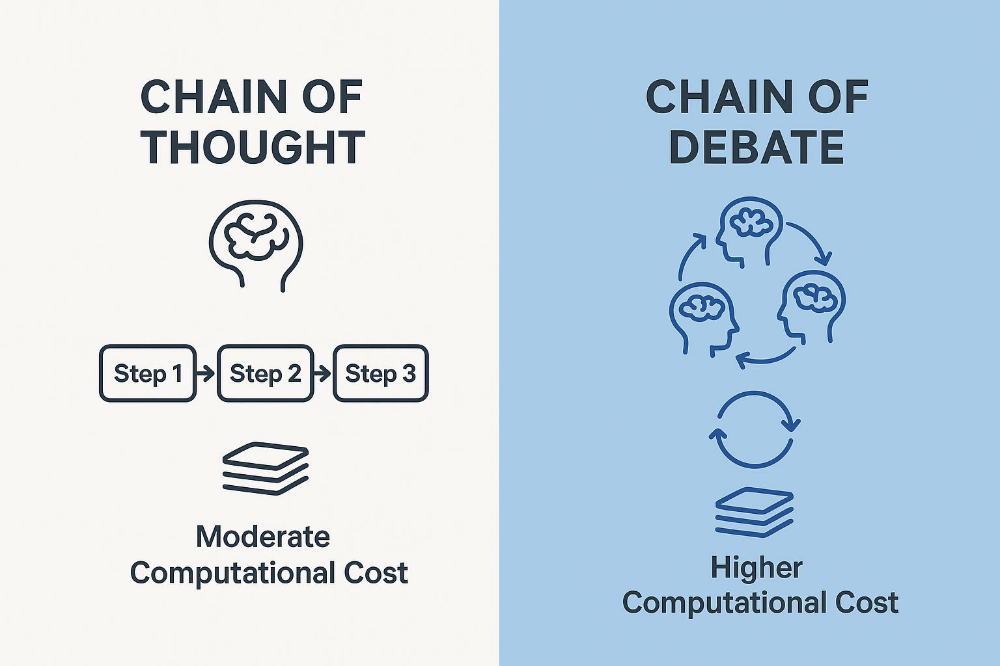
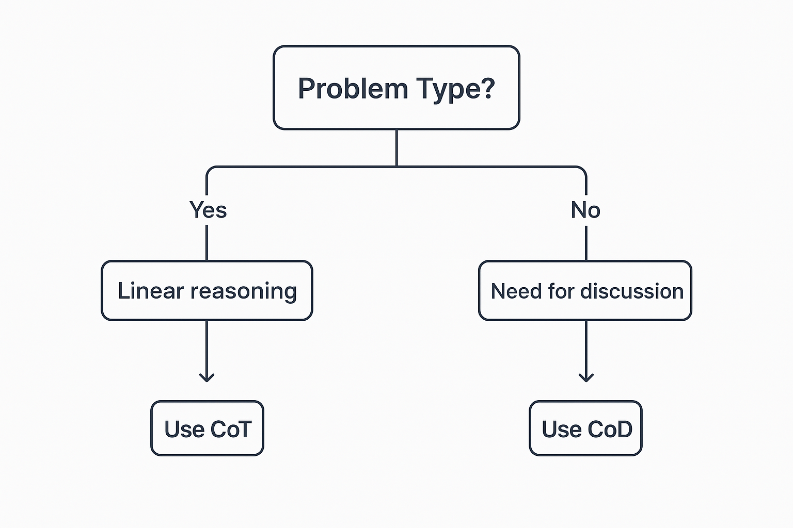

Last week, my professor, Dr. Simon Shim, introduced us to `Chain of Debate` during our [298A Class](https://catalog.sjsu.edu/preview_course_nopop.php?catoid=13&coid=116386). My first thought? "Wait, don't we already have Chain of Thought working great?" This sparked my curiosity to understand what makes these approaches different and when to use each one.

## Chain of Thought (CoT): The Step-by-Step Thinker

**What it is:** [CoT prompts](https://arxiv.org/pdf/2201.11903) AI models to break down complex problems into sequential reasoning steps, similar to showing your work in math class.



### How CoT Works

Instead of jumping straight to an answer, CoT forces the model to:

1. Identify the problem components
2. Work through each step systematically  
3. Show intermediate calculations/reasoning
4. Arrive at a final answer

**Simple Example:**

```text
Problem: Sarah has 15 apples. She gives 4 to her neighbor and buys 7 more. How many apples does Sarah have?

CoT Response:
- Sarah starts with 15 apples
- She gives away 4: 15 - 4 = 11 apples remaining
- She buys 7 more: 11 + 7 = 18 apples
- Final answer: 18 apples
```

### CoT Variants

- **[Zero-shot CoT](https://arxiv.org/pdf/2205.11916)**: Simply add `Let's think step by step` to any prompt
- **Few-shot CoT**: Provide examples showing the step-by-step process
- **[Self-consistency](https://arxiv.org/pdf/2203.11171)**: Generate multiple reasoning paths and pick the most consistent answer

## Chain of Debate (CoD): The Multi-Perspective Collaborator

**What it is:** CoD creates multiple AI `agents` that debate different viewpoints to reach better solutions through collaborative reasoning.



### How CoD Works

1. **Multiple agents** are given the same problem
2. Each generates an **initial solution** from their perspective
3. Agents **critique each other's** responses
4. Through **iterative debate rounds**, they refine their answers
5. Final solution emerges from **consensus or voting**

**Example Scenario:**

```text
Problem: Should our startup prioritize mobile-first development?

Agent 1 (Technical): "Yes, mobile traffic dominates our analytics..."
Agent 2 (Business): "But desktop users have higher conversion rates..."  
Agent 3 (UX): "Mobile-first improves overall user experience across devices..."

[After 2-3 debate rounds, they reach a nuanced solution considering all perspectives]
```

## Key Differences at a Glance



| Aspect | Chain of Thought | Chain of Debate |
|--------|------------------|-----------------|
| **Approach** | Single AI, step-by-step | Multiple AI agents, collaborative |
| **Reasoning** | Linear, sequential | Iterative, argumentative |
| **Computational Cost** | 5-10x standard prompting | 15-30x standard prompting |
| **Best For** | Clear logical problems | Complex, multi-faceted decisions |
| **Transparency** | Shows reasoning steps | Shows full discussion process |
| **Error Detection** | Limited self-correction | Peer review and critique |
| **Implementation** | Simple prompt modification | Complex multi-agent orchestration |

## When to Use Each Approach



### Choose Chain of Thought When

- **Mathematical calculations** need verification
- **Logical reasoning** problems with clear steps  
- **Educational contexts** where process matters
- **Resource constraints** require efficiency
- **Quick responses** are needed
- **Single perspective** is sufficient

**Examples:**

- Debugging code step-by-step
- Financial calculations
- Algorithm explanations
- Technical documentation
- Data analysis workflows

### Choose Chain of Debate When

- **Strategic decisions** need multiple viewpoints
- **Risk assessment** requires comprehensive analysis
- **Creative problem-solving** benefits from diverse approaches
- **Stakeholder alignment** is crucial
- **Error costs** justify additional computation
- **Policy decisions** affect multiple groups

**Examples:**

- Architecture design decisions
- Business strategy planning  
- Product feature prioritization
- Risk management assessments
- Investment decisions
- Team conflict resolution

## Real-World Performance Insights

Recent 2025 research reveals compelling insights about how these approaches perform. A comprehensive study transformed traditional Q&A datasets into structured debates, creating real argumentative scenarios between AI models.

**Key findings from current research:**

- **CoT's foundation**: The original 2022 breakthrough [(Kojima et al.)](https://arxiv.org/pdf/2205.11916) demonstrated dramatic improvements: 17% → 78% accuracy on MultiArith, establishing CoT as transformative for reasoning tasks
- **[2025 debate evaluation discovery](https://arxiv.org/pdf/2507.17747v1)**: While fine-tuning boosted standard Q&A accuracy from 50% to 82%, performance actually declined in debate settings - exposing how models rely on memorization rather than genuine reasoning
- **CoD's strength**: Multi-agent argumentation excels at catching errors that single-agent approaches miss and exposes weaknesses in shallow reasoning
- **Computational costs**: CoD requires 15-30x more resources than standard prompting (vs CoT's 5-10x), but delivers measurably better error detection and reasoning quality
- **Scale dependency**: Both approaches work best with models 100B+ parameters, but CoD shows more consistent performance across different model sizes

**The counterintuitive finding**: Models that appear `smarter` on traditional benchmarks sometimes perform worse when forced to defend their reasoning against opposing arguments. It's like the difference between knowing facts for a test versus arguing your position in a real debate.

The research team made over 5,500 structured debates publicly available, providing valuable benchmarking resources for testing these approaches in real applications.

## Implementation Tips for Engineers

### Starting with CoT

```python
# Simple zero-shot CoT implementation
prompt = f"""
Problem: {user_question}
Let's approach this step-by-step:
1. First, I'll identify what we need to solve
2. Then break it into manageable parts
3. Work through each part systematically
4. Finally, combine for the complete solution
"""
```

### Building CoD Systems

```python
# Basic multi-agent debate structure
agents = [
    {"role": "technical_expert", "perspective": "feasibility"},
    {"role": "business_analyst", "perspective": "ROI"},  
    {"role": "user_advocate", "perspective": "experience"}
]

# Debate rounds with critique and refinement
for round in range(3):
    for agent in agents:
        agent.respond(problem, other_responses)
        agent.critique(other_agents_responses)
    
final_decision = synthesize_consensus(agent_responses)
```

### My Personal Take

After closely analyzing both methods, it’s clear that Chain of Thought (CoT) is the most practical choice for linear tasks. It delivers strong results with minimal computational demands and has become a standard practice in model development.

By contrast, Chain of Debate (CoD) proves more valuable for major architectural decisions, especially where input from multiple specialized areas is critical. Recent surveys and project showcases highlight teams using CoD, assigning `agents` to represent distinct engineering fields and achieving more comprehensive outcomes.

The main lesson? Understand the usecase that you're solving. Use CoT for routine reasoning, but turn to CoD when the situation calls for diverse expertise and collaborative argumentation.

### What’s Next?

The landscape is shifting quickly. Innovations like [DeepSeek V3.1](https://api-docs.deepseek.com/news/news250821)’s `Think` and `Non-Think` modes illustrate a new wave of adaptive reasoning, where AI systems dynamically select between shallow and deep reasoning strategies based on the problem’s demands.

Essentially: Build a strong foundation in CoT, apply CoD for multi-perspective decision-making, and stay alert for hybrid systems that blend these strengths for smarter, more flexible AI reasoning.

Thanks for reading! Now go forth and reason step by step (or start some debates).

---

*Have you experimented with either approach in your projects? I'd love to hear about your experiences with AI reasoning techniques.*
